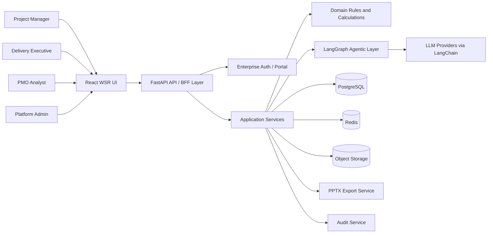
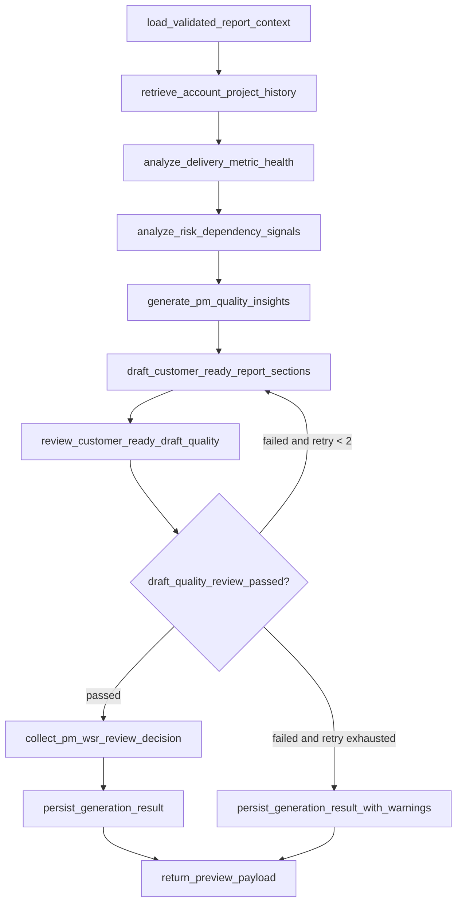
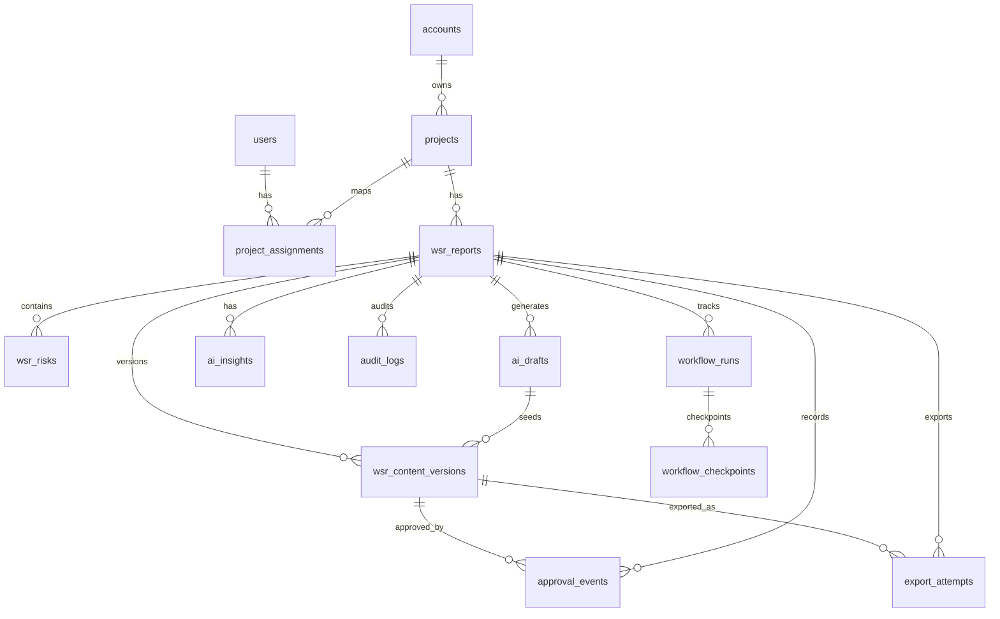

---
stepsCompleted:
  - initialized-from-prd
  - incorporated-ux-design
  - selected-frontend-stack
  - defined-api-middle-backend-agent-layers
  - review-fixes-applied
  - documented-project-folder-structure
  - strengthened-code-and-agent-standards
  - clarified-naming-contracts
  - clarified-generation-trigger-and-ui-data-storage
  - added-grok-deepseek-provider-requirement
  - locked-content-versioning-and-workflow-resume-contracts
  - added-implementation-roadmap
inputDocuments:
  - _bmad-output/planning-artifacts/prd.md
  - _bmad-output/planning-artifacts/ux-design-specification.md
  - _bmad-output/planning-artifacts/wsr-ui-prototype.html
  - _bmad-output/planning-artifacts/bmad-analysis-2026-06-27.md
workflowType: architecture
project_name: wsr_creation_agent
user_name: Prdeepskumar
date: "2026-06-27"
status: Draft
---

# Architecture Decision Document - WSR Agent

## 1. Architecture Goals

WSR Agent is an enterprise WSR creation system, not a generic risk tracker. The architecture must support fast PM data entry, delivery-model-specific forms, deterministic validation, AI-assisted drafting, PM-only insights, approval gates, customer-safe PPTX export, executive dashboards, auditability, and secure account/project isolation.

Primary architectural goals:

- Keep PM-entered facts as the source of truth.
- Use deterministic services for validation, calculations, permissions, approvals, exports, and audit.
- Use LangChain and LangGraph for controlled AI drafting, insight generation, and QA review.
- Keep frontend behavior model-driven so Sprint, PI, and future delivery models do not fork the whole UI.
- Exchange data through typed API contracts.
- Apply DRY, single responsibility, explicit boundaries, testability, observability, and secure-by-default design.

## 2. Recommended Technology Stack

### Frontend

| Concern | Decision | Rationale |
|---|---|---|
| Framework | React + TypeScript | Strong fit for dynamic enterprise forms and reusable internal product components |
| Build | Vite | Fast local development and simple production bundling |
| Routing | TanStack Router or React Router | Typed route definitions and nested layouts for app sections |
| Server state | TanStack Query | Caching, invalidation, retries, optimistic updates for API data |
| Form state | React Hook Form | Efficient large forms with minimal rerendering |
| Validation | Zod | Shared schema style with backend Pydantic concepts; strong typed validation |
| UI styling | Tailwind CSS + internal component primitives | Matches the custom enterprise UI from the prototype without forcing a heavy visual framework |
| Tables | TanStack Table | Risk table, dashboard grids, audit logs |
| State store | Zustand only for UI/session-local state | Avoids overusing global state; API data stays in TanStack Query |
| Testing | Vitest, Testing Library, Playwright | Unit, component, and end-to-end coverage |

Frontend principle: build an internal design system, not one-off page CSS. The prototype is a visual reference; production code should use reusable `SectionCard`, `Field`, `SelectField`, `MetricCard`, `RiskGrid`, `StatusBadge`, and `ActionBar` components.

### Middle Layer / API Layer

| Concern | Decision | Rationale |
|---|---|---|
| API framework | FastAPI | Typed Python APIs, OpenAPI generation, async support |
| API contract | REST + OpenAPI | Clear frontend/backend exchange and easy testing |
| Validation | Pydantic v2 schemas | Strict request/response DTOs with Field descriptions, examples, type hints, and OpenAPI documentation |
| Auth integration | Enterprise SSO adapter or portal auth adapter | Keeps identity provider abstracted |
| Authorization | Policy service in API layer | Centralizes account/project/role checks |
| Background jobs | Celery workers with Redis broker/result backend | AI generation, PPTX export, webhook delivery, retry visibility |
| API style | Resource-oriented endpoints with command endpoints for workflows | Clean CRUD plus explicit actions like generate, approve, export |

### Backend Domain Layer

| Concern | Decision |
|---|---|
| Language | Python |
| Application framework | FastAPI application services |
| ORM / data access | SQLAlchemy 2.x + Alembic |
| Database | PostgreSQL |
| Cache / job broker | Redis for cache, Celery broker, and short-lived job status |
| Object storage | S3-compatible storage or MinIO for PPTX exports |
| Rule engine | Python domain services with pure functions |
| Export | python-pptx behind an export service |
| Observability | Structured logs, OpenTelemetry traces, metrics |

### Agentic Layer

| Concern | Decision |
|---|---|
| Agent orchestration | LangGraph |
| LLM abstraction | LangChain |
| Required versions | LangChain `>=1.0,<2.0`, LangGraph `>=1.0,<2.0` |
| Required LLM providers | Grok via xAI and DeepSeek |
| Provider adapter | Configurable model provider interface with Grok and DeepSeek implementations |
| State | Explicit workflow state object persisted by workflow run ID |
| Retrieval | Approved WSR context scoped by Account + Project in MVP |
| Guardrails | Deterministic validation before and after agent output |
| Output format | Strict structured JSON from agent nodes, rendered by backend services |

## 3. System Context



## 4. Layered Architecture

### 4.0 Project Folder Structure

Use a modular monorepo from the first implementation commit. The folder structure is part of the architecture contract; new files must be added to the owning feature/layer instead of creating broad utility files or oversized page/service modules.

```text
wsr_creation_agent/
  pyproject.toml
  uv.lock
  frontend/
    src/
      app/
      assets/
      components/
      features/
      hooks/
      lib/
      styles/
      test/
    public/
    package.json
    vite.config.ts
    tsconfig.json
  backend/
    src/
      api/
      app/
      core/
      db/
      domain/
      repositories/
      schemas/
      services/
      workers/
      integrations/
      observability/
    tests/
      unit/
      integration/
      contract/
    alembic/
  agent/
    src/
      graphs/
      nodes/
      prompts/
      chains/
      retrieval/
      schemas/
      evaluators/
      safety/
      human_review/
    tests/
  shared/
    openapi/
    contracts/
    docs/
  infra/
    docker/
    migrations/
    scripts/
    environments/
  _bmad-output/
    planning-artifacts/
```

Python package management:

- Use a root `pyproject.toml` managed by `uv` as the Python workspace definition.
- `backend`, `agent`, and `shared` are workspace packages.
- Keep package-specific source and tests under their owning folders, but manage dependency resolution and locking through the root workspace.
- Commit `uv.lock` so backend, agent, and shared package dependencies are reproducible.

Top-level ownership:

| Folder | Owns | Must Not Own |
|---|---|---|
| `frontend/` | React UI, browser-side form state, API client wrappers, UI tests | Backend rules, database access, LLM prompts |
| `backend/` | FastAPI API, application services, domain rules, persistence, workers, export orchestration | React code, prompt text, direct UI presentation logic |
| `agent/` | LangGraph workflows, LangChain chains, prompts, structured agent outputs, retrieval assembly | Database writes, approval/export decisions, API route handling |
| `shared/` | Generated OpenAPI artifacts, contract fixtures, cross-system documentation | Runtime business logic |
| `infra/` | Deployment, local docker, migration runner scripts, environment examples | Application feature logic |

Growth rule: create a new feature folder only when the feature has its own UI, API contract, service/use case, or domain rules. Do not create generic catch-all folders such as `helpers/`, `common/`, or `misc/`.

### 4.1 Frontend Layer

Responsibilities:

- Render model-driven WSR creation UI.
- Maintain local form state and immediate calculated-field feedback.
- Call APIs through typed client functions.
- Show validation errors returned by backend.
- Show PM-only insight panel separately from customer-facing report content.
- Keep calculated fields read-only.
- Never enforce security only in the browser.

Frontend folder structure:

```text
frontend/
  src/
    app/
      router.tsx
      providers.tsx
      queryClient.ts
      routes/
        wsr.routes.tsx
        dashboard.routes.tsx
        admin.routes.tsx
    components/
      layout/
        AppShell.tsx
        TopNav.tsx
        PageHeader.tsx
      form/
        Field.tsx
        SelectField.tsx
        DateField.tsx
        TextAreaField.tsx
      status/
        StatusBadge.tsx
        RagBadge.tsx
      table/
        DataTable.tsx
        EditableGrid.tsx
      feedback/
        InlineError.tsx
        Toast.tsx
        EmptyState.tsx
    features/
      wsr/
        api/
          wsr.api.ts
          wsr.keys.ts
        components/
          WsrCreationPage.tsx
          WsrSectionCard.tsx
          DeliveryModelSection.tsx
          model-setup/
            SprintSetupFields.tsx
            PiSetupFields.tsx
          delivery-progress/
            SprintProgressFields.tsx
            PiProgressFields.tsx
          RiskDependenciesSection.tsx
          AiInsightsPanel.tsx
          ApprovalActions.tsx
        hooks/
          useWsrForm.ts
          useDeliveryModelFields.ts
          useWsrCalculations.ts
        schemas/
          wsrForm.schema.ts
          deliveryModel.schema.ts
          risk.schema.ts
        types/
          wsr.types.ts
        utils/
          wsrDisplay.ts
        __tests__/
      dashboard/
        api/
        components/
        hooks/
        types/
      audit/
        api/
        components/
        types/
      admin/
        api/
        components/
        types/
    hooks/
      useDebouncedValue.ts
    lib/
      apiClient.ts
      errors.ts
      formatters.ts
      constants.ts
      uuid.ts
    styles/
      globals.css
      tokens.css
    test/
      renderWithProviders.tsx
```

Frontend design rules:

- `WsrCreationPage` orchestrates page sections only; it does not contain field-level logic.
- `useWsrCalculations` owns client-side preview calculations.
- Backend remains authoritative for calculations and validation.
- Delivery model fields are data-driven from a `deliveryModelConfig` map.
- Risk row editing is a reusable table component, not embedded page logic.
- PM-only insight components cannot be reused inside export-preview components.
- No feature component should call `fetch` or `axios` directly; use that feature's `api/*.api.ts` module.
- No page component should exceed orchestration responsibility. If a page starts owning validation, table row mutation, calculation, or formatting logic, extract to a hook, schema, or feature utility.
- Shared `components/` contain generic UI only. WSR-specific UI stays under `features/wsr/components/`.

### 4.2 API / Middle Layer

Responsibilities:

- Authenticate user and attach identity context.
- Enforce role, account, and project authorization.
- Validate request DTOs.
- Translate frontend commands into application service calls.
- Return consistent response envelopes and field-level errors.
- Publish OpenAPI contract for frontend generation/tests.
- Add correlation ID to every request.

API modules:

```text
backend/src/api/
  v1/
    router.py
    auth.py
    accounts.py
    projects.py
    wsr.py
    generation.py
    insights.py
    approvals.py
    exports.py
    dashboard.py
    audit.py
    admin.py
  dependencies.py
```

Backend folder structure:

```text
backend/
  src/
    main.py
    app/
      create_app.py
      lifecycle.py
      settings.py
    api/
      dependencies.py
      errors.py
      response_envelope.py
      v1/
        router.py
        auth.py
        accounts.py
        projects.py
        wsr.py
        generation.py
        insights.py
        approvals.py
        exports.py
        dashboard.py
        audit.py
        admin.py
    core/
      enums.py
      ids.py
      clock.py
      permissions.py
      exceptions.py
    schemas/
      base.py
      pagination.py
      auth.py
      account.py
      project.py
      delivery_model.py
      wsr.py
      risk.py
      insight.py
      approval.py
      export.py
      audit.py
    domain/
      delivery_models/
        base.py
        registry.py
        sprint/
          calculations.py
          validation.py
          insight_signals.py
        pi/
          calculations.py
          validation.py
          insight_signals.py
      risks/
        rules.py
        transitions.py
      approvals/
        state_machine.py
      insights/
        trigger_rules.py
      exports/
        customer_safety.py
    services/
      wsr_service.py
      generation_service.py
      prefill_service.py
      approval_service.py
      export_service.py
      dashboard_service.py
      audit_service.py
      admin_config_service.py
    repositories/
      base.py
      users_repository.py
      accounts_repository.py
      projects_repository.py
      wsr_repository.py
      risks_repository.py
      insights_repository.py
      approvals_repository.py
      exports_repository.py
      audit_repository.py
      workflow_runs_repository.py
    db/
      session.py
      models/
        user.py
        account.py
        project.py
        delivery_model_config.py
        wsr_report.py
        wsr_risk.py
        ai_draft.py
        ai_insight.py
        insight_decision.py
        approval_event.py
        export_attempt.py
        audit_log.py
        workflow_run.py
    workers/
      queue.py
      jobs/
        generate_wsr.py
        export_pptx.py
    integrations/
      auth_provider.py
      object_storage.py
      agent_workflow_client.py
      notification_provider.py
    observability/
      logging.py
      tracing.py
      metrics.py
  tests/
    unit/
    integration/
    contract/
```

API response envelope:

```json
{
  "data": {},
  "meta": {
    "correlationId": "018fd6f6-5a91-75ef-9d82-66151f13d3aa",
    "version": "v1"
  },
  "errors": []
}
```

Validation error shape:

```json
{
  "data": null,
  "meta": { "correlationId": "018fd6f6-5a91-75ef-9d82-66151f13d3aa", "version": "v1" },
  "errors": [
    {
      "code": "FIELD_REQUIRED",
      "field": "risks[0].mitigation",
      "message": "Mitigation is required"
    }
  ]
}
```

### 4.3 Backend Application Layer

Responsibilities:

- Coordinate use cases.
- Own transactions.
- Call domain services and repositories.
- Record audit events.
- Enqueue long-running generation/export tasks.
- Preserve draft state across failures.

Application services:

```text
backend/src/services/
  account_service.py
  project_service.py
  wsr_service.py
  delivery_model_service.py
  calculation_service.py
  validation_service.py
  risk_service.py
  insight_service.py
  approval_service.py
  export_service.py
  dashboard_service.py
  audit_service.py
  admin_config_service.py
```

Service responsibility rules:

- `WsrService` coordinates WSR create/update/read lifecycle.
- `CalculationService` computes Sprint/PI derived fields.
- `ValidationService` applies field, model, and cross-field validation.
- `RiskService` validates risk rows inside WSR creation; it does not expose a standalone risk tracker.
- `InsightService` stores read-only PM insights and records insight view audit events.
- `ApprovalService` owns state transitions for submit-review, approve, reject, immutable content versioning, and export eligibility.
- `ExportService` owns customer-safe PPTX generation.
- `AuditService` is append-only and called by application services.
- Services may coordinate repositories and domain rules, but must not contain delivery-model formulas, prompt text, SQLAlchemy model definitions, or HTTP response formatting.
- Repositories may contain SQLAlchemy query construction only; they must not enforce business rules or call services.

### 4.4 Domain Layer

Responsibilities:

- Pure business rules.
- Deterministic calculations.
- Status transition validation.
- Customer-safe export filtering.
- Insight trigger rules.

Domain modules:

```text
backend/src/domain/
  delivery_models/
    base.py
    registry.py
    sprint/
      calculations.py
      validation.py
      insight_signals.py
    pi/
      calculations.py
      validation.py
      insight_signals.py
  risks/
    rules.py
    transitions.py
  insights/
    trigger_rules.py
  approvals/
    state_machine.py
  exports/
    customer_safety.py
```

Delivery model registry:

```python
DELIVERY_MODEL_REGISTRY = {
    DeliveryModel.SPRINT: SprintDeliveryModel(),
    DeliveryModel.PI: PiDeliveryModel(),
}
```

Delivery model identifiers are stable API enum codes, not display labels. The UI may show labels such as "Sprint based" or "PI based", but the API and backend use canonical values such as `SPRINT` and `PI`.

Each delivery model implements:

- `setup_schema`
- `weekly_schema`
- `calculate(input, history)`
- `validate(input, calculated)`
- `insight_signals(input, calculated)`

## 5. Agentic Layer Architecture

### 5.1 Purpose

The agentic layer generates report drafts, PM-only insights, wording improvements, and QA feedback. It must not bypass deterministic validation, approval, export rules, or authorization.

Agent folder structure:

```text
agent/
  src/
    graphs/
      wsr_generation_graph.py
      weekly_status_report_generation_state.py
      graph_config.py
      graph_errors.py
    nodes/
      load_validated_report_context.py
      retrieve_account_project_history.py
      analyze_delivery_metric_health.py
      analyze_risk_dependency_signals.py
      generate_pm_quality_insights.py
      draft_customer_ready_report_sections.py
      review_customer_ready_draft_quality.py
      collect_pm_wsr_review_decision.py
      persist_generation_result.py
    prompts/
      system/
        wsr_drafting.md
        insight_generation.md
        qa_review.md
      examples/
        sprint_examples.md
        pi_examples.md
    chains/
      structured_generation.py
      provider_adapter.py
      retry_policy.py
      providers/
        grok_llm_provider.py
        deepseek_llm_provider.py
    retrieval/
      account_project_retriever.py
      context_ranker.py
      prompt_context_builder.py
      redaction.py
    schemas/
      graph_inputs.py
      graph_outputs.py
      insight_output.py
      draft_output.py
      qa_output.py
    evaluators/
      customer_safety_evaluator.py
      completeness_evaluator.py
      consistency_evaluator.py
    safety/
      output_guardrails.py
      prompt_injection_filters.py
    human_review/
      insight_review.py
      wsr_review.py
  tests/
    nodes/
    graphs/
    fixtures/
```

Agent ownership rules:

- `graphs/` wires LangGraph nodes and retry edges only.
- `nodes/` orchestrate one step each and call chains, retrieval, schemas, or backend service interfaces.
- `prompts/` owns prompt text; prompt strings do not live in Python service or node bodies.
- `schemas/` owns agent structured output DTOs and parser contracts.
- `retrieval/` owns Account + Project context collection, ranking, redaction, and prompt-context assembly.
- `safety/` owns output guardrails and prompt-injection checks.
- `human_review/` owns human-in-the-loop resume payload validation and PM WSR review decision mapping.
- Agent code reads validated WSR state through explicit service interfaces; it does not write directly to the database.
- Prefer LangChain and LangGraph built-in components for prompts, structured output, model invocation, retries, graph state, checkpointing, interrupts, and conditional edges. Write glue code only when the required behavior is not available through first-party LangChain/LangGraph primitives.
- Agent code must be easy to read: each node function has a clear name, typed state input, typed state output, one responsibility, and a docstring explaining what the node adds to graph state.
- Node file names and node function names must use verb + business object naming. Example: `retrieve_account_project_history`, not `retrieve_context`; `draft_customer_ready_report_sections`, not `draft_generation`.
- Grok and DeepSeek provider code must stay behind `agent/src/chains/provider_adapter.py`; graph nodes must not import provider-specific SDKs or classes directly.

### 5.2 LangGraph Workflow



Workflow execution contract:

- `POST /api/v1/wsrs/{wsrId}/generate` creates one `workflow_runs` row and enqueues `generate_wsr`.
- The Celery worker invokes the LangGraph app with `workflow_run_id`, `wsr_id`, `user_id`, and `correlation_id`.
- Human-in-the-loop pauses are exposed as server-side checkpoints, not browser-local state.
- The frontend resumes a paused graph through workflow resume APIs; it never calls LangGraph directly.
- Resume payloads are validated by Pydantic DTOs and persisted before the graph continues.
- The graph finishes only after generated draft content, read-only PM insights, QA metadata, and content version records are persisted.

Workflow limits:

- Maximum QA regeneration attempts: 2.
- Maximum generation wall-clock time: 30 seconds p95 target, with worker-level timeout at 45 seconds.
- If QA still fails after retries, persist the best draft with PM-visible QA warnings; never auto-approve.
- LLM calls use idempotency keys tied to `workflow_run_id` and node name.
- Worker retries are limited to transient infrastructure failures, not failed deterministic validation.
- Human-in-the-loop WSR review uses LangGraph interrupt/checkpoint behavior so the graph can pause, persist state, wait for PM edits to the ready-to-share WSR preview, and resume from the same `workflow_run_id`.
- PM WSR review decisions are treated as graph state, not prompt-only instructions.

Graph implementation contract:

- Use LangGraph `StateGraph` for the WSR generation workflow.
- Use a durable LangGraph PostgreSQL checkpointer so every node output can be recovered by `workflow_run_id`. If the installed LangGraph 1.x version does not provide the required PostgreSQL checkpointer capability, implement the fallback `workflow_checkpoints` table defined in this architecture with the same retention and correlation rules.
- Define clearly named nodes and conditional edges in `agent/src/graphs/wsr_generation_graph.py`; do not define graph topology inside worker job files.
- Use conditional edges for QA retry, QA-warning fallback, and human resume decisions.
- Do not hand-roll a custom state machine while LangGraph provides the required graph, checkpoint, interrupt, and conditional-edge behavior.

Graph state shape:

```python
class WeeklyStatusReportGenerationState(TypedDict, total=False):
    workflow_run_id: UUID
    correlation_id: UUID
    account_id: UUID
    project_id: UUID
    wsr_id: UUID
    user_id: UUID
    validated_report_snapshot: ValidatedWeeklyStatusReportSnapshot
    approved_account_project_history_context: AccountProjectHistoryContext
    delivery_metric_health_signals: DeliveryMetricHealthSignals
    risk_dependency_signals: RiskDependencySignals
    pm_quality_insights: list[GeneratedInsightDTO]
    customer_ready_draft_sections: CustomerReadyDraftSectionsDTO
    ready_to_share_wsr_sections: ReadyToShareWsrContentSectionsDTO
    draft_quality_review_result: DraftQualityReviewDTO
    draft_regeneration_attempt_count: int
    human_review_checkpoint: HumanReviewCheckpoint
    workflow_errors: list[GraphErrorDTO]
```

State rules:

- Every node reads required keys from `WeeklyStatusReportGenerationState` and returns only the keys it owns.
- Every node output is persisted through the checkpointer; no node should rely on hidden module-level memory.
- Node functions must not mutate state in place. Return partial state updates.
- Node errors are captured into `workflow_errors` with `node_name`, `error_code`, `retryable`, and `message`; unexpected exceptions are logged with correlation ID and converted to a controlled workflow failure.
- State stored in the checkpointer must not include raw secrets, API keys, or unredacted prompt-injection content.
- State names must describe the data, not the implementation. Use `approved_account_project_history_context`, not `retrieval_context`; use `customer_ready_draft_sections`, not `draft_sections`.

### 5.3 LangGraph Nodes

| Node | Responsibility | Reads State | Writes State | Deterministic or LLM |
|---|---|---|---|---|
| `load_validated_report_context` | Load validated WSR, user context, account, and project identifiers | `workflow_run_id`, `wsr_id`, `user_id` | `validated_report_snapshot`, `account_id`, `project_id` | Deterministic |
| `retrieve_account_project_history` | Retrieve approved WSR history matching current account ID and project ID | `account_id`, `project_id`, `validated_report_snapshot` | `approved_account_project_history_context` | Deterministic + retrieval |
| `analyze_delivery_metric_health` | Derive Sprint/PI health signals from calculated delivery metrics and prior history | `validated_report_snapshot`, `approved_account_project_history_context` | `delivery_metric_health_signals` | Deterministic |
| `analyze_risk_dependency_signals` | Identify overdue, high-severity, open, weak-mitigation, and repeated risk/dependency signals | `validated_report_snapshot`, `approved_account_project_history_context` | `risk_dependency_signals` | Deterministic |
| `generate_pm_quality_insights` | Generate PM-only quality, actionability, wording, customer-readiness, risk, plan, and discrepancy insights | `validated_report_snapshot`, `delivery_metric_health_signals`, `risk_dependency_signals`, `approved_account_project_history_context` | `pm_quality_insights` | LLM with structured output |
| `draft_customer_ready_report_sections` | Draft editable customer-ready WSR sections using PM-entered facts, historical context, and read-only PM insights as guidance | `validated_report_snapshot`, `approved_account_project_history_context`, `pm_quality_insights` | `customer_ready_draft_sections` | LLM with structured output |
| `review_customer_ready_draft_quality` | Review draft completeness, customer safety, evidence, and consistency before PM approval | `validated_report_snapshot`, `customer_ready_draft_sections`, `pm_quality_insights` | `draft_quality_review_result`, `draft_regeneration_attempt_count` | LLM + deterministic checks |
| `collect_pm_wsr_review_decision` | Pause for PM edits to the ready-to-share WSR preview; this is not formal approval | `customer_ready_draft_sections`, `draft_quality_review_result` | `human_review_checkpoint`, `ready_to_share_wsr_sections` | Human-in-the-loop |
| `persist_generation_result` | Store generated draft, read-only PM insights, QA metadata, warning state, and PM-edited WSR content version | `customer_ready_draft_sections`, `ready_to_share_wsr_sections`, `pm_quality_insights`, `draft_quality_review_result` | persisted IDs in backend store | Deterministic |

Edges:

| Edge Name | From | To | Condition |
|---|---|---|---|
| `start_generation_after_request` | `START` | `load_validated_report_context` | Generation run is queued |
| `continue_after_report_context_loaded` | `load_validated_report_context` | `retrieve_account_project_history` | Validated WSR loaded |
| `continue_after_history_context_ready` | `retrieve_account_project_history` | `analyze_delivery_metric_health` | Retrieval complete or no approved history exists |
| `continue_after_delivery_health_analyzed` | `analyze_delivery_metric_health` | `analyze_risk_dependency_signals` | Delivery metric health signals created |
| `continue_after_risk_dependency_signals_analyzed` | `analyze_risk_dependency_signals` | `generate_pm_quality_insights` | Risk/dependency signals created |
| `continue_after_pm_quality_insights_generated` | `generate_pm_quality_insights` | `draft_customer_ready_report_sections` | Read-only PM quality insights generated |
| `continue_after_customer_ready_draft_created` | `draft_customer_ready_report_sections` | `review_customer_ready_draft_quality` | Customer-ready draft sections generated |
| `regenerate_draft_after_quality_review_failure` | `review_customer_ready_draft_quality` | `draft_customer_ready_report_sections` | Draft quality review failed and `draft_regeneration_attempt_count < 2` |
| `persist_warning_result_after_retry_exhausted` | `review_customer_ready_draft_quality` | `persist_generation_result` | Draft quality review failed and retry exhausted |
| `pause_for_pm_wsr_review` | `review_customer_ready_draft_quality` | `collect_pm_wsr_review_decision` | Draft quality review passed and PM WSR preview review is required |
| `resume_after_pm_wsr_review` | `collect_pm_wsr_review_decision` | `persist_generation_result` | PM resumes after WSR preview review |
| `finish_after_generation_result_persisted` | `persist_generation_result` | `END` | Output persisted |

### 5.4 LangChain Usage

Use LangChain for:

- Provider abstraction.
- Prompt templates.
- Structured output parsing.
- Retrieval chain for approved historical WSR context scoped by account ID + project ID.
- Model fallback policy through a provider adapter.
- Built-in model wrappers, retry wrappers, runnable composition, output parsers, and structured-output helpers before custom glue code.

LLM provider requirements:

- MVP supports Grok through xAI and DeepSeek as the required LLM providers.
- Provider adapters live in `agent/src/chains/providers`. Backend code may call the agent workflow client and persist settings, but it must not contain provider-specific Grok or DeepSeek invocation code.
- Provider selection is runtime configurable through admin settings or environment configuration; do not hard-code one provider in graph nodes.
- Model IDs are configuration values because provider model names can change. Store them as `primary_model_id`, `fallback_model_id`, and `provider_name`.
- Default policy: use the configured primary provider for generation and the configured fallback provider for retryable provider failures.
- Recommended deployment configuration: Grok as primary and DeepSeek as fallback unless admin settings override it.
- Use first-party LangChain integrations for Grok/xAI and DeepSeek when available in the pinned LangChain version. If a required provider capability is missing, implement a thin adapter that exposes the same internal `LlmProviderAdapter` interface.
- Provider-specific request/response objects must be normalized into project DTOs before entering LangGraph state.
- Provider API keys are loaded from secret manager or environment and are never stored in `admin_settings`, `workflow_runs`, graph state, prompts, logs, or audit payloads.
- Observability records provider name, configured model ID, latency, retry count, token usage when available, and sanitized error code.
- Prompts and structured output schemas must be provider-neutral so the same graph can run on Grok or DeepSeek.

Retrieval policy:

- Retrieve only approved WSRs where `account_id` and `project_id` both match the current WSR and the requesting user is authorized for that project.
- Default lookback: latest 8 approved WSRs or 90 calendar days, whichever returns fewer records.
- Ranking order: reporting week recency first, then semantic relevance to current risks, blockers, and delivery model.
- Redact PM-only insights, internal audit notes, rejected drafts, and non-customer-safe content before prompt construction.
- Enforce a per-run context token budget and store retrieved source IDs in `workflow_runs.retrieval_metadata`.

Do not use LangChain for:

- Authorization.
- Required field validation.
- Risk status transition rules.
- Approval state transitions.
- Export customer-safety filtering.

Version and implementation rules:

- Target LangChain `>=1.0,<2.0` and LangGraph `>=1.0,<2.0`.
- Use documented first-party LangChain/LangGraph APIs only; do not depend on private/internal modules.
- Prefer built-in graph interrupts/checkpointing over custom pause/resume tables.
- Prefer structured output support over parsing free-form text with regex.
- Custom glue code is allowed only for application-specific mapping, DTO conversion, telemetry, or policy checks not provided by LangChain/LangGraph.

### 5.5 Agent Output Contracts

Generated draft response:

```json
{
  "executiveSummary": "...",
  "deliveryProgress": "...",
  "riskSummary": "...",
  "nextWeekPlan": "...",
  "customerSafeWarnings": [],
  "qa": {
    "score": 0.91,
    "findings": []
  }
}
```

Insight response:

```json
{
  "insights": [
    {
      "type": "STATUS_DISCREPANCY",
      "severity": "HIGH",
      "category": "CONSISTENCY",
      "description": "GREEN status conflicts with active high risk.",
      "evidence": ["risk_count_high_active=1", "overall_status=GREEN"],
      "recommendation": "Consider AMBER status or add mitigation narrative.",
      "suggestedEdit": "Status is AMBER due to one active high-severity dependency risk with mitigation in progress.",
      "targetField": "overallStatus"
    },
    {
      "type": "CUSTOMER_READY_WORDING",
      "severity": "MEDIUM",
      "category": "CUSTOMER_READY_WORDING",
      "description": "Progress update contains internal implementation detail without stakeholder impact.",
      "evidence": ["progressUpdate contains 'mock endpoints' without explaining delivery impact"],
      "recommendation": "Rewrite the update to explain customer-facing progress and mitigation.",
      "suggestedEdit": "The team completed authentication and continued API integration. A third-party documentation delay was mitigated with parallel development, keeping core delivery progress moving.",
      "targetField": "progressUpdate"
    }
  ]
}
```

All LLM outputs must be parsed, validated, and stored as structured data before the UI sees them.

Insight categories:

| Category | Purpose | Example |
|---|---|---|
| `CONSISTENCY` | Detect conflicts between PM narrative, RAG, metrics, risks, and history | GREEN status with high risk |
| `COMPLETENESS` | Identify missing or thin WSR content | Next week plan lacks outcomes |
| `METRIC_EVIDENCE` | Ask PM to support claims with numbers | Achievement lacks measurable impact |
| `RISK_COMMUNICATION` | Improve risk clarity, mitigation, ownership, and closure explanation | Weak mitigation wording |
| `CUSTOMER_READY_WORDING` | Improve wording for enterprise/customer share readiness | Too technical or internal phrasing |
| `ACTIONABILITY` | Make plan/remarks specific enough for stakeholders | Plan lacks owner or target |
| `TREND_AWARENESS` | Compare current report with Account + Project history | Same blocker repeated for 3 weeks |

## 5.6 Pydantic DTO and Schema Standards

Use Pydantic v2 models for every request, response, nested payload, and agent structured output. These DTOs are the API contract, validation boundary, and OpenAPI documentation source.

Rules:

- Every DTO class uses explicit Python type hints.
- Every externally visible field uses `Field(..., description="...")`.
- Optional fields use `| None` and default to `None`.
- Enums are used for constrained values such as delivery model, RAG, risk status, severity, insight type, and insight category.
- Request DTOs represent user-entered data.
- Response DTOs include server-calculated fields and server state.
- Domain entities are separate from API DTOs.
- SQLAlchemy models are separate from Pydantic DTOs.
- Agent structured outputs use dedicated Pydantic models and are validated before persistence.

Example API DTOs:

```python
from datetime import date
from enum import StrEnum
from uuid import UUID
from pydantic import BaseModel, Field, ConfigDict, model_validator


def to_camel(value: str) -> str:
    parts = value.split("_")
    return parts[0] + "".join(part.title() for part in parts[1:])


class ApiDTO(BaseModel):
    model_config = ConfigDict(
        alias_generator=to_camel,
        populate_by_name=True,
        extra="forbid",
    )


class DeliveryModel(StrEnum):
    SPRINT = "SPRINT"
    PI = "PI"


# MVP API schemas expose only Sprint and PI. Future delivery models such as
# Kanban, Support, Infrastructure, POC, or Milestone must be added through the
# delivery model registry, DTOs, validation, calculations, UI schema,
# persistence mapping, and tests in one coordinated change.
class RagStatus(StrEnum):
    GREEN = "GREEN"
    AMBER = "AMBER"
    RED = "RED"


class RiskStatus(StrEnum):
    OPEN = "OPEN"
    IN_PROGRESS = "IN_PROGRESS"
    CLOSED = "CLOSED"


class RiskSeverity(StrEnum):
    HIGH = "HIGH"
    MEDIUM = "MEDIUM"
    LOW = "LOW"


class ConfidenceLevel(StrEnum):
    HIGH = "HIGH"
    MEDIUM = "MEDIUM"
    LOW = "LOW"


class FieldInputType(StrEnum):
    TEXT = "TEXT"
    TEXTAREA = "TEXTAREA"
    NUMBER = "NUMBER"
    DATE = "DATE"
    SELECT = "SELECT"
    READONLY_METRIC = "READONLY_METRIC"


class DeliveryModelSection(StrEnum):
    SETUP = "SETUP"
    WEEKLY_PROGRESS = "WEEKLY_PROGRESS"
    CALCULATED_METRICS = "CALCULATED_METRICS"


class DeliveryModelFieldOptionDTO(ApiDTO):
    value: str = Field(..., description="Submitted option value.")
    label: str = Field(..., description="Human-readable option label.")


class DeliveryModelFieldMetadataDTO(ApiDTO):
    key: str = Field(..., description="Stable camelCase field key used by API payloads and frontend forms.")
    label: str = Field(..., description="Field label displayed in the WSR form.")
    input_type: FieldInputType = Field(..., description="Frontend input control type.")
    section: DeliveryModelSection = Field(..., description="Delivery-model form section containing this field.")
    required: bool = Field(..., description="Whether this field is required when its delivery model is active.")
    help_text: str | None = Field(None, description="Short helper text shown near the field.")
    options: list[DeliveryModelFieldOptionDTO] = Field(default_factory=list, description="Allowed options for select fields.")
    default_value: str | int | float | bool | None = Field(None, description="Default value suggested by backend metadata.")
    read_only: bool = Field(False, description="Whether the frontend should render the field as read-only.")
    calculated: bool = Field(False, description="Whether the field is calculated by the backend.")
    formula_key: str | None = Field(None, description="Stable formula identifier for calculated fields.")
    validation_hints: list[str] = Field(default_factory=list, description="Validation hints for frontend UX; backend remains authoritative.")
    visible_when: dict[str, str] | None = Field(None, description="Optional visibility rule expressed as field-value equality.")


class DeliveryModelMetadataDTO(ApiDTO):
    delivery_model: DeliveryModel = Field(..., description="Delivery model described by this metadata.")
    metadata_version: str = Field(..., description="Version used by frontend caches and schema migrations.")
    fields: list[DeliveryModelFieldMetadataDTO] = Field(..., description="Ordered field metadata for rendering and validation hints.")


class RiskInputDTO(ApiDTO):
    description: str = Field(..., min_length=10, description="Risk or dependency description entered by the PM.")
    severity: RiskSeverity = Field(..., description="Risk severity selected by the PM.")
    status: RiskStatus = Field(..., description="Current risk status within this WSR.")
    owner_contact: str = Field(..., min_length=2, description="Owner/contact recorded for accountability in the report.")
    mitigation: str = Field(..., min_length=10, description="Mitigation or next action for the risk.")
    planned_closure_date: date = Field(..., description="Target closure date for the risk.")
    closure_remark: str | None = Field(None, description="Required when risk status is Closed.")

    @model_validator(mode="after")
    def require_closure_remark_for_closed(self) -> "RiskInputDTO":
        if self.status == RiskStatus.CLOSED and not self.closure_remark:
            raise ValueError("closureRemark is required when risk status is CLOSED.")
        return self


class SprintSetupDTO(ApiDTO):
    sprint_name: str = Field(..., min_length=1, description="Sprint name or number.")
    start_date: date = Field(..., description="Sprint start date.")
    end_date: date = Field(..., description="Sprint end date.")
    planned_stories: int = Field(..., ge=0, description="Stories planned for the sprint.")
    planned_story_points: int = Field(..., ge=0, description="Story points planned for the sprint.")
    planned_effort_hours: int = Field(..., ge=0, description="Planned sprint effort in hours.")
    dor_percent: int = Field(..., ge=0, le=100, description="Definition-of-ready adherence percentage.")


class SprintWeeklyProgressDTO(ApiDTO):
    progress_update: str = Field(..., min_length=20, description="PM-entered Sprint progress narrative for the reporting week.")
    stories_completed: int = Field(..., ge=0, description="Stories completed during this reporting week.")
    story_points_completed: int = Field(..., ge=0, description="Story points completed during this reporting week.")
    effort_burned_hours: int = Field(..., ge=0, description="Effort burned during this reporting week.")
    unplanned_stories: int = Field(..., ge=0, description="Unplanned stories added during this reporting week.")
    unplanned_story_points: int = Field(..., ge=0, description="Unplanned story points added during this reporting week.")
    rag_status: RagStatus = Field(..., description="PM-selected customer-facing delivery status.")
    next_week_plan: str = Field(..., min_length=10, description="Planned work and focus areas for next week.")
    remarks: str | None = Field(None, description="Additional stakeholder-safe remarks.")


class CalculatedSprintMetricsDTO(ApiDTO):
    completion_percent: float = Field(..., ge=0, le=100, description="Story-count completion percentage.")
    point_completion_percent: float = Field(..., ge=0, le=100, description="Story-point completion percentage.")
    effort_usage_percent: float = Field(..., ge=0, description="Effort burned as a percentage of planned effort.")


class PiWeeklyProgressDTO(ApiDTO):
    current_sprint: int = Field(..., ge=1, description="Current sprint or iteration in the PI.")
    progress_update: str = Field(..., min_length=20, description="PM-entered PI progress narrative for the reporting week.")
    story_points_completed_this_week: int = Field(..., ge=0, description="Story points completed during this reporting week.")
    features_completed_this_week: int = Field(..., ge=0, description="Features or objectives completed during this reporting week.")
    delayed_scope_items: int = Field(..., ge=0, description="Scope items delayed or moved out during this reporting week.")
    blockers_dependencies_count: int = Field(..., ge=0, description="Current blockers or dependencies count.")
    rag_status: RagStatus = Field(..., description="PM-selected customer-facing delivery status.")
    next_week_plan: str = Field(..., min_length=10, description="Planned work and focus areas for next week.")
    remarks: str | None = Field(None, description="Additional stakeholder-safe remarks.")


class CalculatedPiMetricsDTO(ApiDTO):
    completed_to_date_story_points: int = Field(..., ge=0, description="Prior completed points plus current week completed points.")
    completion_percent: float = Field(..., ge=0, le=100, description="PI completion percentage.")
    remaining_story_points: int = Field(..., ge=0, description="Remaining planned story points.")
    required_velocity: float = Field(..., ge=0, description="Velocity required to complete remaining points within remaining sprints.")
    average_velocity: float = Field(..., ge=0, description="Average velocity through the current sprint.")
    confidence: ConfidenceLevel = Field(..., description="Confidence based on average vs required velocity.")


class ReadyToShareReportMetadataDTO(ApiDTO):
    account_name: str = Field(..., description="Customer/account name displayed in the ready-to-share WSR.")
    project_name: str = Field(..., description="Project name displayed in the ready-to-share WSR.")
    reporting_period: str = Field(..., description="Human-readable reporting period.")
    prepared_by_name: str = Field(..., description="Display name of the PM preparing the WSR.")
    delivery_model: DeliveryModel = Field(..., description="Delivery model used for this WSR.")
    rag_status: RagStatus = Field(..., description="Customer-facing RAG status.")


class ReadyToShareMetricSummaryDTO(ApiDTO):
    story_completion_percent: float | None = Field(None, ge=0, le=100, description="Sprint story-count completion percentage when applicable.")
    story_point_completion_percent: float | None = Field(None, ge=0, le=100, description="Sprint story-point completion percentage when applicable.")
    effort_usage_percent: float | None = Field(None, ge=0, description="Sprint effort usage percentage when applicable.")
    pi_completion_percent: float | None = Field(None, ge=0, le=100, description="PI completion percentage when applicable.")
    open_high_risk_count: int = Field(..., ge=0, description="Open high-severity risks included in the WSR summary.")


class ReadyToShareWsrContentSectionsDTO(ApiDTO):
    schema_version: str = Field(..., description="Content schema version for approval, export, and future prefill.")
    report_metadata: ReadyToShareReportMetadataDTO = Field(..., description="Display metadata for the WSR report header.")
    metric_summary: ReadyToShareMetricSummaryDTO = Field(..., description="Customer-safe summary metrics displayed in the WSR.")
    executive_summary: str = Field(..., min_length=20, description="Customer-facing executive summary.")
    delivery_progress: str = Field(..., min_length=20, description="Customer-facing delivery progress narrative.")
    key_achievements: str = Field(..., min_length=10, description="Customer-facing achievements for the reporting period.")
    risks_and_dependencies_summary: str = Field(..., min_length=10, description="Customer-facing risk and dependency summary.")
    next_week_focus_and_actions: str = Field(..., min_length=10, description="Customer-facing next week focus and action narrative.")
    customer_facing_remarks: str | None = Field(None, description="Optional customer-facing remarks.")


class WsrReviewDecision(StrEnum):
    SAVE_WSR_PREVIEW = "SAVE_WSR_PREVIEW"
    SUBMIT_FOR_APPROVAL = "SUBMIT_FOR_APPROVAL"


class WsrReviewRequestDTO(ApiDTO):
    content_sections: ReadyToShareWsrContentSectionsDTO = Field(..., description="PM-edited ready-to-share WSR content.")
    review_note: str | None = Field(None, description="Optional internal PM note for the review event.")
    decision: WsrReviewDecision = Field(..., description="Whether to save edited preview or submit it for approval.")


class WsrReviewResponseDTO(ApiDTO):
    wsr_id: UUID = Field(..., description="WSR ID associated with this review.")
    content_version_id: UUID = Field(..., description="Persisted WSR content version created from the review.")
    generation_status: str = Field(..., description="Generation workflow status after review persistence.")
    lifecycle_status: str = Field(..., description="WSR lifecycle status after review persistence.")
```

Pydantic DTOs validate request shape, enum values, basic field constraints, and local conditional rules. Cross-object business rules live in domain validation services, including `current_sprint <= total_sprints`, completed points not exceeding planned points unless explicitly allowed by the delivery model, approved-report immutability, and account/project authorization.

Delivery model metadata response example:

```json
{
  "deliveryModel": "SPRINT",
  "metadataVersion": "delivery-models.v1",
  "fields": [
    {
      "key": "plannedStoryPoints",
      "label": "Planned story points",
      "inputType": "NUMBER",
      "section": "SETUP",
      "required": true,
      "helpText": "Story points committed for the sprint.",
      "readOnly": false,
      "calculated": false,
      "validationHints": ["min:0"]
    },
    {
      "key": "pointCompletionPercent",
      "label": "Point completion %",
      "inputType": "READONLY_METRIC",
      "section": "CALCULATED_METRICS",
      "required": false,
      "readOnly": true,
      "calculated": true,
      "formulaKey": "sprint_point_completion_percent"
    }
  ]
}
```

Example agent output DTOs:

```python
class InsightCategory(StrEnum):
    CONSISTENCY = "CONSISTENCY"
    COMPLETENESS = "COMPLETENESS"
    METRIC_EVIDENCE = "METRIC_EVIDENCE"
    RISK_COMMUNICATION = "RISK_COMMUNICATION"
    CUSTOMER_READY_WORDING = "CUSTOMER_READY_WORDING"
    ACTIONABILITY = "ACTIONABILITY"
    TREND_AWARENESS = "TREND_AWARENESS"


class InsightSeverity(StrEnum):
    HIGH = "HIGH"
    MEDIUM = "MEDIUM"
    LOW = "LOW"


class InsightType(StrEnum):
    STATUS_DISCREPANCY = "STATUS_DISCREPANCY"
    CUSTOMER_READY_WORDING = "CUSTOMER_READY_WORDING"
    MISSING_EVIDENCE = "MISSING_EVIDENCE"
    WEAK_MITIGATION = "WEAK_MITIGATION"
    INCOMPLETE_NEXT_PLAN = "INCOMPLETE_NEXT_PLAN"
    REPEATED_BLOCKER = "REPEATED_BLOCKER"


class GeneratedInsightDTO(ApiDTO):
    type: InsightType = Field(..., description="Specific insight type.")
    category: InsightCategory = Field(..., description="Business category used for grouping PM-only insights.")
    severity: InsightSeverity = Field(..., description="Insight severity.")
    description: str = Field(..., description="Concise explanation of the issue or improvement opportunity.")
    evidence: list[str] = Field(..., description="Data points supporting the insight.")
    recommendation: str = Field(..., description="Action the PM can take.")
    suggested_edit: str | None = Field(None, description="Optional PM-reviewable wording improvement.")
    target_field: str | None = Field(None, description="Field the suggestion applies to.")
```

## 6. API Structure

### 6.1 Core Resources

```text
GET    /api/v1/me
GET    /api/v1/accounts
GET    /api/v1/accounts/{accountId}/projects
GET    /api/v1/accounts/{accountId}/projects/{projectId}/delivery-model
PUT    /api/v1/accounts/{accountId}/projects/{projectId}/delivery-model

POST   /api/v1/wsrs
GET    /api/v1/wsrs/{wsrId}
PATCH  /api/v1/wsrs/{wsrId}
POST   /api/v1/wsrs/{wsrId}/save-draft
GET    /api/v1/wsrs/prefill?accountId={accountId}&projectId={projectId}

POST   /api/v1/wsrs/{wsrId}/validate
POST   /api/v1/wsrs/{wsrId}/generate
GET    /api/v1/wsrs/{wsrId}/generation/{runId}
POST   /api/v1/wsrs/{wsrId}/generation/{runId}/wsr-review

GET    /api/v1/wsrs/{wsrId}/insights

POST   /api/v1/wsrs/{wsrId}/submit-review
POST   /api/v1/wsrs/{wsrId}/approve
POST   /api/v1/wsrs/{wsrId}/reject

POST   /api/v1/wsrs/{wsrId}/exports/pptx
GET    /api/v1/exports/{exportId}

GET    /api/v1/dashboard/projects
GET    /api/v1/audit/wsrs/{wsrId}
GET    /api/v1/admin/health
GET    /api/v1/admin/settings/llm-providers
PATCH  /api/v1/admin/settings/llm-providers
POST   /api/v1/admin/settings/llm-providers/test
GET    /api/v1/admin/settings/retention
PATCH  /api/v1/admin/settings/retention
GET    /api/v1/admin/settings/integrations
PATCH  /api/v1/admin/settings/integrations
```

API ID and naming rules:

- All persisted entity IDs are UUIDs. Prefer UUIDv7 for time-sortable IDs where database/runtime support is available; UUIDv4 is acceptable otherwise.
- Public JSON uses camelCase. Python DTOs and database columns use snake_case.
- Every route that accepts `wsrId`, `insightId`, `exportId`, or `projectId` resolves the record server-side and verifies account/project authorization before returning data or mutating state.
- `accountId` and `projectId` are UUID strings in API payloads, even when examples use short labels in prototypes.
- Workflow resume endpoints require the `workflow_runs.status` to be `WAITING_FOR_PM_WSR_REVIEW`, and they reject stale or completed run IDs.
- Admin settings endpoints require platform-admin authorization and never return provider API secret values.

Workflow resume payloads:

- `POST /generation/{runId}/wsr-review` accepts edited `contentSections`, optional `reviewNote`, and `decision`. Allowed decisions are `SAVE_WSR_PREVIEW` and `SUBMIT_FOR_APPROVAL`.
- The WSR review resume endpoint persists PM input first, then resumes the LangGraph workflow from the matching checkpoint.
- Resume endpoints are idempotent for the same `runId`, checkpoint name, and request idempotency key.

Example WSR review request:

```json
{
  "decision": "SAVE_WSR_PREVIEW",
  "reviewNote": "Updated customer-facing next week focus.",
  "contentSections": {
    "schemaVersion": "ready-to-share-wsr.v1",
    "reportMetadata": {
      "accountName": "TechCorp Inc.",
      "projectName": "TechCorp Portal Revamp",
      "reportingPeriod": "Jun 23 - Jun 27, 2026",
      "preparedByName": "Arjun Kapoor",
      "deliveryModel": "SPRINT",
      "ragStatus": "AMBER"
    },
    "metricSummary": {
      "storyCompletionPercent": 67,
      "storyPointCompletionPercent": 69,
      "effortUsagePercent": 88,
      "piCompletionPercent": null,
      "openHighRiskCount": 1
    },
    "executiveSummary": "Authentication module completed and API integration progressed with controlled mitigation for vendor documentation dependency.",
    "deliveryProgress": "The team completed core authentication work and advanced API integration while managing API documentation dependency.",
    "keyAchievements": "Completed authentication module. Established API integration baseline.",
    "risksAndDependenciesSummary": "API integration dependency remains actively managed through vendor clarification and parallel testing.",
    "nextWeekFocusAndActions": "Complete API validation, confirm dashboard API contract, and close vendor documentation dependency.",
    "customerFacingRemarks": "Delivery remains under active control with focused mitigation."
  }
}
```

### 6.2 WSR Draft Request

```json
{
  "accountId": "018fd6f6-5a91-75ef-9d82-66151f13d3ab",
  "projectId": "018fd6f6-5a91-75ef-9d82-66151f13d3ac",
  "reportingWeek": "2026-06-27",
  "preparedBy": "018fd6f6-5a91-75ef-9d82-66151f13d3ad",
  "deliveryModel": "PI",
  "modelSetup": {
    "piName": "PI 2026-Q3",
    "piStartDate": "2026-06-23",
    "piEndDate": "2026-09-12",
    "totalSprints": 6,
    "plannedStoryPoints": 280,
    "committedFeatures": 12,
    "targetRelease": "Portal v2.4",
    "piObjectives": "Auth, API, Dashboard"
  },
  "weeklyProgress": {
    "currentSprint": 2,
    "progressUpdate": "API work recovered using mock endpoints.",
    "storyPointsCompletedThisWeek": 42,
    "featuresCompletedThisWeek": 2,
    "delayedScopeItems": 1,
    "blockersDependenciesCount": 2,
    "ragStatus": "AMBER",
    "nextWeekPlan": "...",
    "remarks": "..."
  },
  "risks": [
    {
      "description": "Third-party API documentation delay",
      "severity": "HIGH",
      "status": "OPEN",
      "ownerContact": "Priya Rao",
      "mitigation": "Use mock endpoints and schedule vendor clarification",
      "plannedClosureDate": "2026-07-03",
      "closureRemark": null
    }
  ]
}
```

### 6.3 WSR Response

```json
{
  "id": "018fd6f6-5a91-75ef-9d82-66151f13d3ae",
  "lifecycleStatus": "DRAFT",
  "calculatedMetrics": {
    "piCompletedToDate": 87,
    "piCompletionPercent": 31,
    "remainingStoryPoints": 193,
    "requiredVelocity": 48,
    "averageVelocity": 44,
    "confidence": "MEDIUM"
  },
  "validation": {
    "isValid": true,
    "errors": []
  }
}
```

### 6.4 Generation Trigger and Persistence Flow

The LangGraph workflow does not execute on page load, prefill, field edit, local calculation, or ordinary draft save. It executes only when the PM explicitly requests generation and the backend has validated and persisted the latest draft.

Generation trigger flow:

1. PM edits fields in the React WSR form.
2. Frontend keeps local form state and local preview calculations only.
3. PM saves draft or clicks generate.
4. API validates request shape with Pydantic DTOs.
5. Application service recalculates server-authoritative metrics.
6. Application service persists the full draft snapshot and normalized risk rows in a transaction.
7. Validation service runs required-field, model-specific, risk, and cross-field rules.
8. If validation fails, the graph is not started and field-level errors are returned.
9. If validation passes, `generation_status` becomes `QUEUED`, a `workflow_runs` row is created, and the worker starts the LangGraph workflow.
10. LangGraph loads the persisted validated report snapshot by `wsr_id`; it does not trust unsaved browser state.

Commands that do not start LangGraph:

- `GET /api/v1/wsrs/prefill`
- local frontend auto-calculation
- `POST /api/v1/wsrs/{wsrId}/save-draft`
- `POST /api/v1/wsrs/{wsrId}/validate`
- risk row add/remove before explicit generate

Commands that can start LangGraph:

- `POST /api/v1/wsrs/{wsrId}/generate`, only after persistence and validation success.

### 6.5 UI Input Storage Map

All PM-entered UI data must be stored, but not every UI field gets its own relational column. Use a hybrid model:

- Store canonical identifiers, lifecycle fields, searchable/reporting fields, and calculated snapshots in relational columns.
- Store complete PM-entered form data in versioned JSONB snapshots on `wsr_reports`.
- Store repeatable risk/dependency rows in `wsr_risks` because they are queried by dashboards, insights, and overdue/high-severity filters.
- Store generated customer-facing draft sections in `ai_drafts`.
- Store PM-edited customer-facing report content in `wsr_content_versions`.
- Store PM-only insights separately in `ai_insights`.
- Store PM insight view events in `audit_logs`; insights themselves are read-only guidance.
- Store approvals, exports, and audit events in their own append-oriented tables.

| UI / Workflow Data | Storage Location | Reason |
|---|---|---|
| Account, project, reporting week, prepared by, delivery model, lifecycle status | `wsr_reports` columns | Authorization, filtering, lifecycle control |
| Project overview fields | `wsr_reports.entered_data_snapshot` JSONB | Complete draft restoration and audit context |
| Delivery model setup such as Sprint setup or PI setup | `wsr_reports.model_setup_snapshot` JSONB | Model-specific shape changes over time |
| Weekly progress fields such as completed stories, PI points, blockers, remarks, RAG status | `wsr_reports.weekly_progress_snapshot` JSONB | Complete PM-entered delivery data |
| Achievements, next-week plans, additional notes | `wsr_reports.entered_data_snapshot` JSONB | Draft restoration and generation input |
| Server-calculated values such as completion %, remaining points, required velocity, confidence | `wsr_reports.calculated_metrics_snapshot` JSONB | Reproducible validation, insights, export, audit |
| Risk/dependency rows | `wsr_risks` rows plus parent WSR snapshot reference | Queryable risk dashboard and insight signals |
| Generated customer-ready draft sections | `ai_drafts` | Separation from PM-only insights and PM raw input |
| PM-edited customer-ready content | `wsr_content_versions` | Source of truth for review, approval, export, and future prefill |
| PM-only AI insights | `ai_insights` | Never exported to customer PPTX |
| PM insight view event | `audit_logs` | Auditability without creating insight decision workflow |
| Submit, approve, reject events | `approval_events` | Immutable approval history tied to a content version |
| PPTX export attempts and object keys | `export_attempts` | Idempotent export and troubleshooting |
| Field changes, validation failures, generation request, edits, approval, export | `audit_logs` | Compliance evidence |
| LangGraph node state, retrieved source IDs, errors, retry count, HITL checkpoint | `workflow_runs` plus LangGraph checkpointer store | Resumable stateful agent execution |

Storage rules:

- A saved draft must be restorable from database state without relying on frontend local storage.
- A generation run must always use the latest persisted and validated draft, not unsaved UI state.
- JSONB snapshots are versioned with `schema_version` so delivery-model fields can evolve without destructive migrations.
- Generated AI content and PM-only insights must not be stored in the same column as PM-entered input.
- Customer export reads only the latest approved `wsr_content_versions` row and never reads PM-only insight fields or stale `ai_drafts`.
- Audit logs record changed field paths and before/after values for PM edits where practical; large JSON snapshots may be referenced by snapshot version instead of duplicated in full.
- `ai_drafts` are AI output records. `wsr_content_versions` are PM-reviewable and approvable report records. Approval and export must reference `wsr_content_versions.id`.

## 7. Data Architecture

### 7.1 Database Tables

Core tables:

| Table | Primary Key | Important Foreign Keys | Purpose |
|---|---|---|---|
| `users` | `id UUID` | None | Authenticated people using the product |
| `accounts` | `id UUID` | None | Customer/account boundary |
| `projects` | `id UUID` | `account_id -> accounts.id` | Delivery project under an account |
| `project_assignments` | `id UUID` | `user_id -> users.id`, `project_id -> projects.id` | Role mapping for authorization |
| `delivery_model_configs` | `id UUID` | `project_id -> projects.id`, `updated_by -> users.id` | Active delivery model and model-specific defaults |
| `wsr_reports` | `id UUID` | `account_id -> accounts.id`, `project_id -> projects.id`, `prepared_by -> users.id` | WSR header, lifecycle state, PM-entered snapshots, calculated snapshot |
| `wsr_risks` | `id UUID` | `account_id -> accounts.id`, `project_id -> projects.id`, `wsr_report_id -> wsr_reports.id` | Risk/dependency rows inside one WSR |
| `ai_drafts` | `id UUID` | `account_id -> accounts.id`, `project_id -> projects.id`, `wsr_report_id -> wsr_reports.id`, `workflow_run_id -> workflow_runs.id` | Generated customer-facing draft sections |
| `wsr_content_versions` | `id UUID` | `account_id -> accounts.id`, `project_id -> projects.id`, `wsr_report_id -> wsr_reports.id`, nullable `source_ai_draft_id -> ai_drafts.id`, `edited_by -> users.id` | PM-editable and approvable customer-facing report content |
| `ai_insights` | `id UUID` | `account_id -> accounts.id`, `project_id -> projects.id`, `wsr_report_id -> wsr_reports.id`, `workflow_run_id -> workflow_runs.id` | PM-only insight records |
| `approval_events` | `id UUID` | `account_id -> accounts.id`, `project_id -> projects.id`, `wsr_report_id -> wsr_reports.id`, `content_version_id -> wsr_content_versions.id`, `actor_id -> users.id` | Submit, approve, reject, and re-approval history |
| `export_attempts` | `id UUID` | `account_id -> accounts.id`, `project_id -> projects.id`, `wsr_report_id -> wsr_reports.id`, `content_version_id -> wsr_content_versions.id`, `requested_by -> users.id` | PPTX export attempts and generated object locations |
| `audit_logs` | `id UUID` | `actor_id -> users.id`, nullable `account_id -> accounts.id`, nullable `project_id -> projects.id`, nullable `wsr_report_id -> wsr_reports.id` | Append-only audit trail |
| `admin_settings` | `id UUID` | `updated_by -> users.id` | Runtime configuration, including active LLM provider policy without storing secrets |
| `workflow_runs` | `id UUID` | `account_id -> accounts.id`, `project_id -> projects.id`, `wsr_report_id -> wsr_reports.id`, `requested_by -> users.id` | LangGraph execution tracking and resumable checkpoint metadata |
| `workflow_checkpoints` | `id UUID` | `workflow_run_id -> workflow_runs.id` | Fallback durable graph checkpoint store when LangGraph PostgreSQL checkpointer is unavailable |

Database constraints:

- Use PostgreSQL `uuid` column type for all primary and foreign keys.
- Foreign keys are enforced in the database; application code may not rely only on ORM relationships.
- Tables containing WSR-derived records carry `account_id` and `project_id` directly for tenant isolation, audit filtering, retention, and faster dashboard queries. These values must match the parent `wsr_reports` row.
- `projects(account_id, id)` must be indexed for account/project authorization checks.
- `project_assignments(user_id, project_id)` must be unique.
- `wsr_reports(account_id, project_id, reporting_week)` must be unique per report version policy. If multiple versions are allowed, add `version_number` and make `(account_id, project_id, reporting_week, version_number)` unique.
- `wsr_content_versions(wsr_report_id, version_number)` must be unique.
- At most one `APPROVED` content version should be active for a WSR at a time; enforce through a partial unique index where supported.
- `wsr_risks(wsr_report_id, status, severity, planned_closure_date)` must be indexed for dashboard and insight queries.
- Child records use `ON DELETE RESTRICT` for approved/exported reports. Draft cleanup jobs must archive rather than silently delete approved history.

Minimum physical schema columns:

| Table | Required Key Columns |
|---|---|
| `users` | `id UUID PK`, `email TEXT NOT NULL UNIQUE`, `display_name TEXT NOT NULL`, `status TEXT NOT NULL`, `created_at TIMESTAMPTZ NOT NULL`, `updated_at TIMESTAMPTZ NOT NULL` |
| `accounts` | `id UUID PK`, `name TEXT NOT NULL`, `status TEXT NOT NULL`, `created_at TIMESTAMPTZ NOT NULL`, `updated_at TIMESTAMPTZ NOT NULL` |
| `projects` | `id UUID PK`, `account_id UUID NOT NULL FK accounts(id)` |
| `project_assignments` | `id UUID PK`, `user_id UUID NOT NULL FK users(id)`, `project_id UUID NOT NULL FK projects(id)`, `role TEXT NOT NULL` |
| `wsr_reports` | `id UUID PK`, `account_id UUID NOT NULL FK accounts(id)`, `project_id UUID NOT NULL FK projects(id)`, `prepared_by UUID NOT NULL FK users(id)`, `lifecycle_status TEXT NOT NULL`, `generation_status TEXT NOT NULL`, `reporting_week DATE NOT NULL`, `delivery_model TEXT NOT NULL`, `schema_version TEXT NOT NULL`, `version_number INT NOT NULL DEFAULT 1`, `entered_data_snapshot JSONB NOT NULL DEFAULT '{}'`, `model_setup_snapshot JSONB NOT NULL DEFAULT '{}'`, `weekly_progress_snapshot JSONB NOT NULL DEFAULT '{}'`, `calculated_metrics_snapshot JSONB NOT NULL DEFAULT '{}'` |
| `wsr_risks` | `id UUID PK`, `account_id UUID NOT NULL FK accounts(id)`, `project_id UUID NOT NULL FK projects(id)`, `wsr_report_id UUID NOT NULL FK wsr_reports(id)`, `description TEXT NOT NULL`, `severity TEXT NOT NULL`, `status TEXT NOT NULL`, `owner_contact TEXT NOT NULL`, `mitigation TEXT NOT NULL`, `planned_closure_date DATE NOT NULL`, `closure_remark TEXT`, `source_risk_id UUID` |
| `ai_drafts` | `id UUID PK`, `account_id UUID NOT NULL FK accounts(id)`, `project_id UUID NOT NULL FK projects(id)`, `wsr_report_id UUID NOT NULL FK wsr_reports(id)`, `workflow_run_id UUID NOT NULL FK workflow_runs(id)`, `draft_sections JSONB NOT NULL`, `qa_warnings JSONB NOT NULL DEFAULT '[]'` |
| `wsr_content_versions` | `id UUID PK`, `account_id UUID NOT NULL FK accounts(id)`, `project_id UUID NOT NULL FK projects(id)`, `wsr_report_id UUID NOT NULL FK wsr_reports(id)`, `source_ai_draft_id UUID FK ai_drafts(id)`, `version_number INT NOT NULL`, `status TEXT NOT NULL`, `content_sections JSONB NOT NULL`, `edited_by UUID NOT NULL FK users(id)`, `approved_at TIMESTAMPTZ`, `created_at TIMESTAMPTZ NOT NULL` |
| `ai_insights` | `id UUID PK`, `account_id UUID NOT NULL FK accounts(id)`, `project_id UUID NOT NULL FK projects(id)`, `wsr_report_id UUID NOT NULL FK wsr_reports(id)`, `workflow_run_id UUID NOT NULL FK workflow_runs(id)`, `type TEXT NOT NULL`, `category TEXT NOT NULL`, `severity TEXT NOT NULL`, `evidence JSONB NOT NULL DEFAULT '[]'`, `recommendation TEXT NOT NULL`, `suggested_edit TEXT`, `target_field TEXT` |
| `approval_events` | `id UUID PK`, `account_id UUID NOT NULL FK accounts(id)`, `project_id UUID NOT NULL FK projects(id)`, `wsr_report_id UUID NOT NULL FK wsr_reports(id)`, `content_version_id UUID NOT NULL FK wsr_content_versions(id)`, `actor_id UUID NOT NULL FK users(id)`, `decision TEXT NOT NULL`, `reason TEXT`, `created_at TIMESTAMPTZ NOT NULL` |
| `export_attempts` | `id UUID PK`, `account_id UUID NOT NULL FK accounts(id)`, `project_id UUID NOT NULL FK projects(id)`, `wsr_report_id UUID NOT NULL FK wsr_reports(id)`, `content_version_id UUID NOT NULL FK wsr_content_versions(id)`, `requested_by UUID NOT NULL FK users(id)`, `status TEXT NOT NULL`, `object_key TEXT`, `error_code TEXT`, `created_at TIMESTAMPTZ NOT NULL` |
| `audit_logs` | `id UUID PK`, `actor_id UUID FK users(id)`, `account_id UUID FK accounts(id)`, `project_id UUID FK projects(id)`, `wsr_report_id UUID FK wsr_reports(id)`, `event_type TEXT NOT NULL`, `field_path TEXT`, `before_value JSONB`, `after_value JSONB`, `correlation_id UUID NOT NULL`, `created_at TIMESTAMPTZ NOT NULL` |
| `admin_settings` | `id UUID PK`, `setting_key TEXT NOT NULL UNIQUE`, `value JSONB NOT NULL`, `updated_by UUID NOT NULL FK users(id)`, `updated_at TIMESTAMPTZ NOT NULL` |
| `workflow_runs` | `id UUID PK`, `account_id UUID NOT NULL FK accounts(id)`, `project_id UUID NOT NULL FK projects(id)`, `wsr_report_id UUID NOT NULL FK wsr_reports(id)`, `requested_by UUID NOT NULL FK users(id)`, `status TEXT NOT NULL`, `checkpoint_id TEXT`, `retrieval_metadata JSONB NOT NULL DEFAULT '{}'`, `workflow_error_summary JSONB NOT NULL DEFAULT '[]'` |
| `workflow_checkpoints` | `id UUID PK`, `workflow_run_id UUID NOT NULL FK workflow_runs(id)`, `checkpoint_name TEXT NOT NULL`, `state_payload JSONB NOT NULL`, `created_at TIMESTAMPTZ NOT NULL`, `expires_at TIMESTAMPTZ` |

LLM provider settings schema:

| Setting | Storage | Notes |
|---|---|---|
| `primary_llm_provider` | `admin_settings.value` | Allowed values: `GROK`, `DEEPSEEK` |
| `fallback_llm_provider` | `admin_settings.value` | Allowed values: `GROK`, `DEEPSEEK`; may be disabled only by admin |
| `primary_model_id` | `admin_settings.value` | Provider model ID; configurable, not hard-coded |
| `fallback_model_id` | `admin_settings.value` | Provider model ID; configurable, not hard-coded |
| `provider_timeout_seconds` | `admin_settings.value` | Must fit within workflow timeout budget |
| `provider_max_retries` | `admin_settings.value` | Retry only transient provider failures |
| Grok API key | Secret manager / environment | Do not store in database |
| DeepSeek API key | Secret manager / environment | Do not store in database |

### 7.2 Entity Relationships



### 7.3 Risk Storage Decision

Use `wsr_risks` as a child table of WSR reports, not an independent risk-tracker workspace.

Reason:

- Risks are entered and edited inside WSR creation.
- Querying risks for dashboards and insights is easier and safer than JSON-only storage.
- Owner/contact remains report metadata, not a separate workflow assignee.

### 7.4 Key State Fields

Use one report lifecycle field as the source of truth. Do not store a separate `approval_status` on `wsr_reports`.

`wsr_reports.lifecycle_status`:

- `DRAFT`
- `GENERATING`
- `GENERATED`
- `IN_REVIEW`
- `APPROVED`
- `REJECTED`
- `EXPORTED`

`approval_events.decision`:

- `SUBMITTED`
- `APPROVED`
- `REJECTED`

Lifecycle rules:

- `generate` moves a validated `DRAFT` to `GENERATING` while the worker runs.
- Successful generation moves `GENERATING` to `GENERATED` and creates a `wsr_content_versions` row with `status=GENERATED`.
- `submit-review` moves `GENERATED` to `IN_REVIEW` and marks the selected content version `IN_REVIEW`.
- `approve` moves `IN_REVIEW` to `APPROVED` for MVP PM approval, records `approval_events.content_version_id`, and marks that content version `APPROVED`.
- `reject` moves `IN_REVIEW` to `REJECTED` with mandatory reason.
- Any edit after `APPROVED` always creates a new `wsr_content_versions` row and requires re-approval. Previously approved content versions are immutable.
- `export` is allowed only from `APPROVED`; successful export reads the approved `content_version_id`, creates an `export_attempts` row, and moves the report to `EXPORTED` while retaining approval event history.

`generation_status`:

- `NOT_STARTED`
- `QUEUED`
- `RUNNING`
- `WAITING_FOR_PM_WSR_REVIEW`
- `SUCCEEDED`
- `SUCCEEDED_WITH_WARNINGS`
- `FAILED`
- `CANCELLED`

## 8. Calculation Architecture

Backend owns canonical calculations; frontend mirrors calculations for immediate UX feedback.

Calculation rules:

| Metric | Formula |
|---|---|
| Sprint completion % | `0 if planned_stories == 0 else min(stories_completed / planned_stories * 100, 100)` |
| Sprint point completion % | `0 if planned_story_points == 0 else min(story_points_completed / planned_story_points * 100, 100)` |
| Sprint effort usage % | `0 if planned_effort_hours == 0 else effort_burned_hours / planned_effort_hours * 100` |
| PI completed to date | `prior_completed_story_points + story_points_completed_this_week` |
| PI completion % | `0 if planned_story_points == 0 else completed_to_date_story_points / planned_story_points * 100` |
| PI remaining story points | `max(planned_story_points - completed_to_date_story_points, 0)` |
| PI sprints remaining | `max(total_sprints - current_sprint, 1)` |
| PI required velocity | `remaining_story_points / sprints_remaining` |
| PI average velocity | `0 if current_sprint == 0 else completed_to_date_story_points / current_sprint` |
| PI confidence | High if average velocity >= required velocity; Medium if >= 80% of required velocity; Low otherwise |

Implementation:

- Frontend `useWsrCalculations` provides non-authoritative previews.
- Backend `CalculationService` recalculates on save, validate, generate, and approve.
- Calculated metrics are persisted with WSR snapshots for auditability.

## 9. Security Architecture

Security rules:

- All API routes require authenticated identity except health checks.
- Account/project authorization is checked server-side on every request.
- PM-only insights never appear in export DTOs.
- Generated content and insight content are stored separately.
- Export service reads only approved customer-facing content.
- Audit logs are append-only from application code.
- Secrets are loaded from secret manager or environment, never source.

Authorization policy examples:

| Action | Required Access |
|---|---|
| Create WSR | PM assigned to project |
| Edit Draft | PM assigned to project and WSR not approved |
| Submit Review | PM assigned to project and lifecycle status is `DRAFT` or `GENERATED` |
| Approve WSR | Assigned PM or future configured approver and lifecycle status is `IN_REVIEW` or `GENERATED` |
| View Dashboard | Delivery executive/PMO authorized for account/project scope |
| View Audit | PMO/admin authorized for project/account scope |
| Export PPTX | Approved WSR and authorized user |

## 10. Observability Architecture

Every request and workflow run carries:

- `correlation_id`
- `user_id`
- `account_id`
- `project_id`
- `wsr_id` when available
- `workflow_run_id` for generation

Required telemetry:

- API latency.
- Validation failure count.
- Draft save failures.
- LangGraph node duration.
- LLM provider latency/failure.
- Generation success/failure.
- Export success/failure.
- Approval/rejection events.
- Audit write failures.

Log format:

```json
{
  "level": "INFO",
  "event": "wsr.generation.node.completed",
  "correlationId": "018fd6f6-5a91-75ef-9d82-66151f13d3aa",
  "workflowRunId": "018fd6f6-5a91-75ef-9d82-66151f13d3af",
  "node": "draft_customer_ready_report_sections",
  "durationMs": 832
}
```

## 11. Code Quality and Design Principles

### DRY

- One delivery model registry shared by validation, calculation, insight signals, and UI metadata.
- One API client layer in frontend.
- One backend DTO schema per request/response contract.
- One source of export customer-safety rules.
- One delivery model field definition per model, reused by frontend metadata, backend validation, calculations, and insight signals through explicit generated or mapped contracts.
- One lifecycle state machine for submit-review, approve, reject, immutable content versioning, and export transitions.

### Single Responsibility

- UI components render and emit changes.
- Hooks manage form state and local calculations.
- API layer handles HTTP concerns.
- Application services coordinate use cases.
- Domain services implement pure rules.
- Repositories handle persistence only.
- Agent nodes perform one workflow responsibility each.

### Readability and Simplicity

Code should be easy for a new engineer to understand without reading the whole repository.

- Prefer clear names over clever abstractions.
- Prefer simple functions and explicit flow over generic frameworks created inside the project.
- Do not over-engineer with factories, base classes, decorators, metaprogramming, or plugin systems unless there is an immediate repeated use case.
- Keep business language visible in code: use names like `calculate_pi_completion`, `require_closed_risk_remark`, and `approve_wsr` instead of vague names like `process`, `handler`, or `manager`.
- Split code by responsibility before it becomes difficult to read; do not wait for a large refactor.
- Write code that is boring, typed, testable, and predictable.

### Naming Standards

Names must explain purpose, business meaning, and data shape. A coder should understand what a class, function, state key, graph node, or edge does from the name alone.

General rules:

- Use domain language from the PRD: `weekly_status_report`, `delivery_metric_health`, `risk_dependency`, `customer_ready`, `pm_quality_insight`, `approval`, `export`.
- Avoid vague words: `data`, `info`, `payload`, `manager`, `processor`, `handler`, `util`, `helper`, `do`, `run`, `process`.
- Use abbreviations only when they are established in the product: `WSR`, `PI`, `RAG`, `PM`, `PPTX`.
- Prefer specific names even when longer. Clear names are better than short names that hide meaning.
- Boolean names start with `is_`, `has_`, `can_`, `should_`, or `requires_`.
- Collection names are plural: `pm_quality_insights`, `approval_events`, `risk_dependency_rows`.
- Date/time names include the concept: `reporting_week`, `planned_closure_date`, `approval_submitted_at`.

Backend examples:

| Artifact | Good Name | Avoid |
|---|---|---|
| Domain function | `calculate_pi_completion_percent` | `calculate`, `process_metrics` |
| Domain rule | `require_closed_risk_closure_remark` | `validate_risk` |
| Service method | `submit_weekly_status_report_for_review` | `submit`, `update_status` |
| Repository method | `list_approved_reports_for_account_project` | `get_reports` |
| API DTO | `WeeklyStatusReportDraftRequest` | `WsrRequest`, `Payload` |
| SQLAlchemy model | `WeeklyStatusReportModel` | `Report`, `DataModel` |
| Exception | `ApprovedReportCannotBeEditedError` | `ValidationError`, `AppError` |

Frontend examples:

| Artifact | Good Name | Avoid |
|---|---|---|
| Page | `WsrCreationPage` | `MainPage` |
| Section | `RiskDependenciesSection` | `RiskTableWrapper` |
| Hook | `useWsrFormDraftAutosave` | `useFormStuff` |
| Formatter | `formatRagStatusLabel` | `formatStatus` |
| Zod schema | `weeklyStatusReportDraftSchema` | `formSchema` |

Agent examples:

| Artifact | Good Name | Avoid |
|---|---|---|
| State class | `WeeklyStatusReportGenerationState` | `GraphState`, `WsrState` |
| State key | `approved_account_project_history_context` | `retrieval_context`, `history` |
| Node | `draft_customer_ready_report_sections` | `draft_generation_node` |
| Edge | `resume_after_pm_draft_review` | `continue`, `edge_2` |
| Error DTO | `GraphNodeExecutionErrorDTO` | `ErrorDTO` |

Naming review rule: if a file, class, function, state key, node, or edge name needs a comment to explain its purpose, rename it before adding the comment.

### Docstrings and Comments

- Every public Python class has a docstring explaining its responsibility and boundary.
- Every public Python function or method has a docstring explaining what it does, important inputs, return value, and raised domain exceptions when relevant.
- LangGraph node functions must document which state keys they read and write.
- Complex domain rules get short comments explaining the business reason, not line-by-line narration.
- Avoid unnecessary comments that repeat the code.
- Frontend components do not need comments for normal JSX; add comments only for non-obvious state, accessibility, or performance decisions.

Example Python docstring style:

```python
def calculate_pi_completion(input: PiCalculationInput) -> CalculatedPiMetrics:
    """Calculate PI progress metrics from PM-entered weekly values.

    Returns server-authoritative metrics used by validation, insights, and export.
    Raises DomainValidationError when required denominator values are invalid.
    """
```

### AI Code Generation Token Discipline

When AI agents generate implementation code, they should minimize nonessential commentary in generated files.

- Do not add banner comments, decorative section comments, or repeated explanations.
- Do not add TODO comments unless the task explicitly leaves a known follow-up.
- Do not add unused examples, placeholder functions, sample data, or speculative extension hooks.
- Do not generate broad abstractions for future use. Build the smallest clean structure that satisfies the current PRD, UX, and architecture.
- Prefer concise docstrings over long explanatory blocks.
- Test names should describe behavior clearly so comments are not needed.

### Error Handling

- Convert external failures into typed application errors at the boundary where they occur.
- API routes return structured error envelopes with correlation ID and field-level errors where applicable.
- Domain validation raises typed domain exceptions, not generic `Exception`.
- Services own transaction rollback and audit failure handling.
- Repositories translate database constraint failures into repository errors; services decide user-facing behavior.
- Agent nodes catch expected provider, parsing, retrieval, and timeout failures and write controlled `GraphErrorDTO` entries into state.
- Unexpected exceptions are logged with correlation ID, workflow run ID, node name, and sanitized context before failing the workflow.
- Do not swallow exceptions silently.
- Do not expose stack traces, prompts, secrets, or internal provider payloads to users.
- Retry only retryable failures such as transient network/provider errors; do not retry deterministic validation failures.

### File and Module Size Guardrails

These are implementation guardrails, not hard runtime limits, but code reviews should challenge violations:

| Artifact | Preferred Limit | Action When Exceeded |
|---|---:|---|
| React page component | 200 lines | Extract sections, hooks, or feature utilities |
| React section component | 180 lines | Extract fields, tables, or row components |
| React hook | 150 lines | Split form state, calculations, API orchestration, and derived display data |
| Python API route module | 250 lines | Split by resource/action or move orchestration to service |
| Python service | 250 lines | Split use cases or move pure rules to domain |
| Python domain rule module | 220 lines | Split by delivery model or rule category |
| LangGraph node file | 160 lines | Extract chain, retriever, evaluator, or mapper |
| Prompt file | 150 lines | Split system rules, task instructions, and examples |

No file should become the default place for unrelated additions. If a change touches more than one responsibility, create the missing module instead of expanding the nearest existing file.

### Feature Ownership Rules

- WSR creation UI belongs under `frontend/src/features/wsr`.
- Dashboard UI belongs under `frontend/src/features/dashboard`; it may consume dashboard APIs but must not reuse WSR form internals.
- Admin UI belongs under `frontend/src/features/admin`; it must not own runtime business rules.
- Delivery-model formulas belong under `backend/src/domain/delivery_models/{model}/calculations.py`.
- Delivery-model required-field and cross-field validation belong under `backend/src/domain/delivery_models/{model}/validation.py`.
- Risk row rules belong under `backend/src/domain/risks`.
- Approval transitions belong under `backend/src/domain/approvals/state_machine.py`.
- API DTOs belong under `backend/src/schemas`; SQLAlchemy models belong under `backend/src/db/models`; never combine them.
- LangGraph prompt text belongs under `agent/src/prompts`; prompt text must not be embedded inside backend services.
- Data access belongs only in repositories. API routes, services, domain rules, and agent nodes do not issue raw SQL.

### Adding or Changing a Feature

When adding a new product capability, update the architecture-owned layers in this order:

1. API contract: add or update DTOs in `backend/src/schemas` and route shape in `backend/src/api/v1`.
2. Domain rules: add pure calculations, validation, state transitions, or signal rules under `backend/src/domain`.
3. Persistence: add SQLAlchemy models under `backend/src/db/models`, repositories under `backend/src/repositories`, and Alembic migrations.
4. Application use case: add orchestration in `backend/src/services`.
5. Agent behavior: add graph node, prompt, retrieval, schema, or evaluator only if AI behavior is required.
6. Frontend: add feature API wrapper, Zod schema, hook, component, and route under the owning `frontend/src/features/*` folder.
7. Tests: add unit tests for domain, service tests for orchestration, API contract tests, agent parser/node tests, and frontend component/E2E coverage based on risk.

Do not add a field by changing only the UI. Delivery-model fields require synchronized updates to frontend schema, backend DTO, domain validation, calculations, insight signals, persistence snapshot, and tests.

### Import Boundary Rules

Frontend import direction:

```text
app -> features -> components/hooks/lib
features -> components/hooks/lib
components -> lib
```

Backend import direction:

```text
api -> schemas/services/core
services -> domain/repositories/schemas/core
repositories -> db/core
domain -> core
workers -> services/core
```

Agent import direction:

```text
graphs -> nodes/schemas
nodes -> chains/retrieval/schemas/evaluators/safety
chains -> prompts/schemas/safety
retrieval -> schemas/safety
```

Import boundary rules:

- `domain` must not import `schemas`, `repositories`, `db`, `api`, or `agent`.
- `schemas` must not import `services`, `repositories`, `db`, or `agent`.
- `repositories` must not import `services`, `api`, or `agent`.
- `frontend/src/components` must not import from `frontend/src/features`.
- `agent` must not import SQLAlchemy models or repositories.
- `shared` must not import runtime code from `frontend`, `backend`, or `agent`.

### Dependency Direction

Allowed:

- API -> services -> domain/repositories.
- Services -> domain and repositories.
- Agent nodes -> domain read-only rules and services through explicit interfaces.

Not allowed:

- Domain importing API, ORM, LangChain, or UI types.
- Repositories calling services.
- Agent nodes writing directly to database.
- Frontend bypassing API contracts.
- Shared utilities depending on feature modules.
- Feature modules importing from another feature's private components, hooks, or schemas.
- Domain rules importing repositories, FastAPI, SQLAlchemy sessions, LangChain, or Pydantic API DTOs.
- Prompts importing or duplicating deterministic validation rules; prompts can reference summarized rule outputs produced by domain services.

### Testing Strategy

| Layer | Tests |
|---|---|
| Domain | Calculation, validation, risk transition, insight trigger unit tests |
| Services | Use-case tests with repository fakes |
| API | Contract tests and authorization tests |
| Agentic | Node tests with fixed model outputs and parser validation |
| Frontend | Component tests for model switching, formulas, risk row add/remove |
| E2E | PM creates WSR, PI calculation, generate draft, approve, export |

## 12. Deployment Architecture

Recommended deployment units:

- `frontend-web`: static React app served by CDN or web server.
- `api`: FastAPI API service.
- `celery-worker`: background jobs for generation, workflow resume, export, and webhook delivery.
- `celery-beat`: optional scheduled cleanup and retention jobs when enabled.
- `postgres`: managed PostgreSQL.
- `redis`: managed Redis used as Celery broker/result backend and cache.
- `object-storage`: S3-compatible export storage.
- `observability`: logs, traces, metrics.

Runtime flow:

1. Frontend saves draft through API.
2. API validates authorization and request shape.
3. Application service recalculates metrics and persists draft.
4. User requests generation.
5. API validates draft and enqueues generation run.
6. Worker executes LangGraph workflow.
7. Draft and insights are persisted.
8. PM reviews, edits, decides insights, and approves.
9. Export service creates PPTX from approved customer-safe content.

## 13. Architecture Decisions Summary

| Area | Decision |
|---|---|
| Frontend | React + TypeScript + Vite with internal component primitives |
| Form handling | React Hook Form + Zod |
| API data | TanStack Query |
| API | FastAPI REST + OpenAPI |
| Backend | Python services, Pydantic DTOs, SQLAlchemy repositories |
| Project structure | Modular monorepo with `frontend`, `backend`, `agent`, `shared`, and `infra` ownership boundaries |
| Database | PostgreSQL |
| Cache/jobs | Redis with Celery workers |
| Agentic layer | LangGraph `>=1.0,<2.0` orchestration with LangChain `>=1.0,<2.0` provider abstraction |
| Agent state | Stateful `WeeklyStatusReportGenerationState` with checkpointer persistence for every node output |
| Human-in-the-loop | LangGraph interrupt/checkpoint pauses for PM WSR review |
| Code quality | Simple, typed, readable code with public Python class/function docstrings and minimal commentary |
| Error handling | Typed domain/application/repository/agent errors with structured API envelopes and correlation IDs |
| Export | python-pptx service over approved customer-safe content |
| Risk handling | WSR child table, no standalone risk-tracker workspace |
| Calculations | Backend canonical, frontend preview |
| Security | Server-side authorization on every protected request |
| Observability | Correlation ID across API, workflow, LLM, persistence, export |

## 14. Implementation Guardrails for AI Coding Agents

- Do not create a standalone risk tracker.
- Do not expose PM-only insights in export DTOs.
- Do not store generated customer-facing content and PM-only insights in the same field.
- Do not let frontend calculations become canonical.
- Do not call LLMs before deterministic validation passes.
- Do not let LangGraph nodes write directly to repositories.
- Do not hand-roll graph state, checkpointing, interrupt, retry, prompt, or structured-output behavior when LangChain/LangGraph 1.x provides a first-party component.
- Do not create custom agent glue code unless it maps project DTOs, telemetry, policy, or behavior not covered by LangChain/LangGraph built-ins.
- Do not make agent nodes stateless; every node must read/write typed `WeeklyStatusReportGenerationState` keys and persist through the checkpointer.
- Do not skip the human-in-the-loop pause for PM WSR review.
- Do not add new delivery model fields without updating registry, DTOs, validation, calculations, UI schema, and tests.
- Do not duplicate calculation formulas across random components; use shared calculation modules.
- Do not approve or export a WSR without server-side state transition checks.
- Do not place multiple responsibilities in one page, service, route, repository, graph, or node file.
- Do not add generic `helpers`, `common`, or `misc` modules as a dumping ground.
- Do not add a new field or delivery model without updating the owning frontend, backend, persistence, agent, and test contracts together.
- Do not allow imports that violate the documented frontend, backend, or agent dependency direction.
- Do not over-engineer with speculative factories, decorators, base classes, or plugin systems.
- Do not use vague names such as `process`, `handler`, `manager`, `data`, `payload`, `context`, `result`, or `node` when a business-specific name is available.
- Do not add graph nodes, edges, state keys, classes, or functions whose names fail to describe the business action or data they own.
- Do not generate banner comments, repeated explanations, unused examples, placeholders, or unnecessary TODOs.
- Do not omit docstrings on public Python classes/functions or LangGraph nodes.
- Do not swallow exceptions silently or expose stack traces, prompts, secrets, or provider payloads to users.
